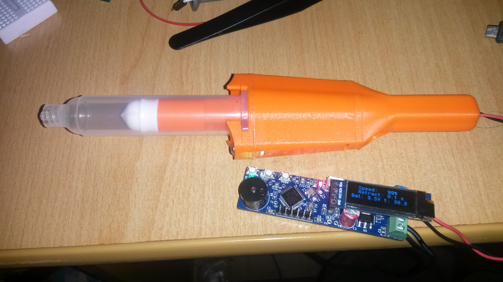

# Solder-Paste-Dispenser
Motorized automatic solder paste dispenser. 
## __Work-in-progress__

The idea came from this project:
https://hackaday.io/project/169748-low-cost-solder-paste-dispenser

Some differences:

+ Controled with 32bit processor STM32F103C8T6 ( original is STM32F030)
+ used output H-bridge for motor control TB67H451FNG ( https://www.aliexpress.com/item/1005001738294266.html?spm=a2g0s.9042311.0.0.27424c4dVMVyey )
+ DC micromotor 6V / 60 rpm with gearbox without thread rod ( https://www.aliexpress.com/item/33022320164.html?spm=a2g0s.9042311.0.0.266b4c4dmW3uVV )
+ Coupler to thread rod ( https://www.aliexpress.com/item/1005002015620915.html?spm=a2g0s.9042311.0.0.266b4c4dmW3uVV )
+ larger syringe 10 ccm ( https://www.aliexpress.com/item/10000092421369.html?spm=a2g0s.9042311.0.0.27424c4dw27aah )
+ redesigned mechanism of operation and piston mounting

!! warning component links may be invalid over time !!

OLED display 128x32 pixels

