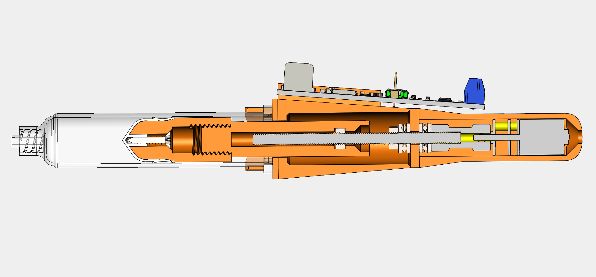

# 3D Printed Solder-Paste-Dispenser
Motorized automatic solder paste dispenser.
Easily printable on a 3D printer at home
## __Work-in-progress__

The idea came from this project:
https://hackaday.io/project/169748-low-cost-solder-paste-dispenser

Some differences:

+ Controled with 32bit processor STM32F103C8T6 ( original is STM32F030)
+ used output H-bridge for motor control TB67H451FNG ( https://www.aliexpress.com/item/1005001738294266.html?spm=a2g0s.9042311.0.0.27424c4dVMVyey )
+ DC micromotor 6V / 60 rpm with gearbox without thread rod ( https://www.aliexpress.com/item/33022320164.html?spm=a2g0s.9042311.0.0.266b4c4dmW3uVV )
+ Coupler to thread rod ( https://www.aliexpress.com/item/1005002015620915.html?spm=a2g0s.9042311.0.0.266b4c4dmW3uVV )
+ larger syringe 10 ccm ( https://www.aliexpress.com/item/10000092421369.html?spm=a2g0s.9042311.0.0.27424c4dw27aah )
+ redesigned mechanism of operation and piston mounting

!! warning component links may be invalid over time !!

+ OLED display 128x32 pixels
+ The supply voltage is 9V

PCB is designed in KiCAD software

+ Source code of Firmware is optimized for STM32CubeIDE and CubeMX software from ST Microelectronics.

+ Source code are easy aplicable to another IDE.

+ It would be a little more difficult to migrate to the Arduino IDE, but even that is partially possible - it has not been tested

+ CAD files are designed in SolidWorks, preview here:
https://grabcad.com/library/3d-printed-solder-paste-dispenser-1

+ All params are immeidiately saved to emulated EEprom(FLASH CPU) after select

+ Speed list : 10, 20, 30, 40, 50, 60, 70, 80, 99%

+ Retract duration List: 0(dissable), 100, 200, 300, 400, 500, 1000, 1500, 2000ms
+ Continuous measurement of battery voltage and CPU temperature
+ 
+ Video from the first tests of movement mechanics   https://youtu.be/HmdS7s8p9XI 
+ The first version of the printouts on my 3D printer

 

